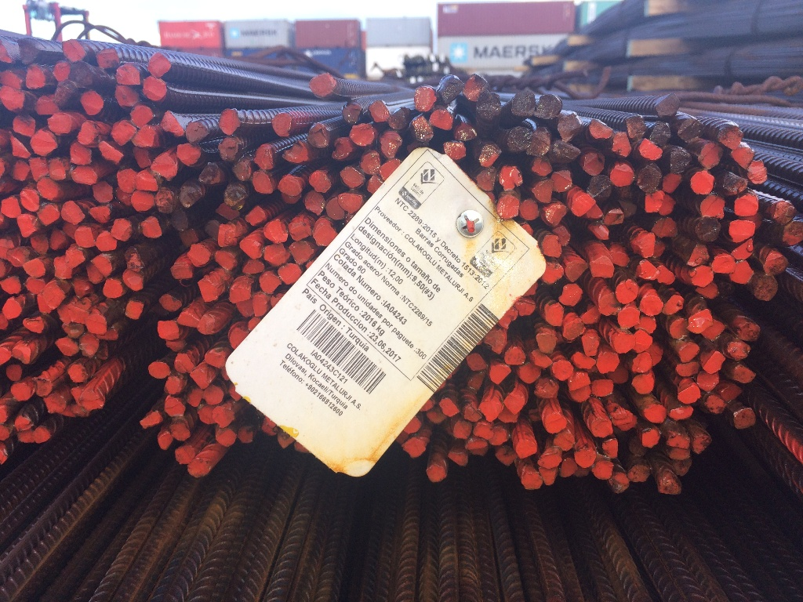

# Dipstick Dataset

    POWERED BY
    ▀█▀ ▒█▄░▒█ ▒█░▄▀ ▒█▀▀█ ▒█▀▀▀ ▒█▀▄▀█ ▒█▀▀▀ ▒█▄░▒█ ▀▀█▀▀ ░█▀▀█ ▒█░░░
    ▒█░ ▒█▒█▒█ ▒█▀▄░ ▒█▄▄▀ ▒█▀▀▀ ▒█▒█▒█ ▒█▀▀▀ ▒█▒█▒█ ░▒█░░ ▒█▄▄█ ▒█░░░
    ▄█▄ ▒█░░▀█ ▒█░▒█ ▒█░▒█ ▒█▄▄▄ ▒█░░▒█ ▒█▄▄▄ ▒█░░▀█ ░▒█░░ ▒█░▒█ ▒█▄▄█
    https://www.inkremental.co/

The images are of minimum 512 pixels and maximum 1024 pixels of withd or height, in some images it is obfuscated with black patches, because there were too many very small rods.



## VOC format

See more [https://pjreddie.com/projects/pascal-voc-dataset-mirror/](https://pjreddie.com/projects/pascal-voc-dataset-mirror/)

## make sets

``` bash
# Comand to make sets
cd VOC_dipstick/Annotations
ArrayName=(train_*)
for var in "${ArrayName[@]}"
do
echo "${var/\.xml/}" >> ../ImageSets/Main/train.txt
done

ArrayName=(*)
for var in "${ArrayName[@]}"
do
echo "${var/\.xml/}" >> ../ImageSets/Main/all.txt
done
count 
for var in "${ArrayName[@]}"
do
echo mv "${var}"
done

```

## Update dataset

Este dataset está enfocado a crear un modelo para las varillas de esfuerzo que se usan para la construcción mayormente, se usará el algoritmo de marcado VOC.

Las imágenes que se encuentran aquí, minimo son de 512 pixeles y máximo de 1024 pixeles, por favor no modifique el tamaño de las imágenes 

En esta carpeta se encuentran 4 carpetas, anotaciones xml + imagenes para entrenar (train_*),  anotaciones xml + imagenes para validar (valid_*).

Como llenar el data set
Instalación
Usaremos el programa de python labelImg, instrucciones de instalación en el git del programa (https://github.com/tzutalin/labelImg)

Instrucciones de uso
Abrir el directorio de la imágenes con “Open Dir”

Luego darle en “open” en la parte inferior derecha

Cambiar el directorio de las anotaciones en “change save dir”

Seleccionar la carpeta de anotaciones respectivas ww

crear un rectángulo por cada varilla coherente con el icono o la tecla “w”

introducir el label “dipstick” en todas las varillas

también pueden usar este campo para más rapidez

recuerde guardar antes de cambiar de imagen

Si hay una varilla difícil de detectar o parcialmente mostrada, por favor marcarla y usar el checkbox “difficult” (debe aparecer al menos el 60% de la varilla”)